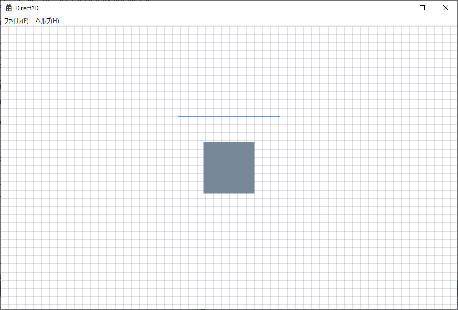

# Win32 API + Direct2Dのアプリ

## VS2022のウィザードを使ってアプリのひな型を作成

1. VS2022のメニューの[ファイル]-[新規作成]-[プロジェクト(P)...]を選択
1. 新しいプロジェクトの作成のウィザードが表示される
1. C++, Windowsを選んでWindowsデスクトップアプリケーション選択。
1. 右下の次へ(N)ボタンを押下
1. 新しいプロジェクトを構成します画面が表示
1. プロジェクト名はDirect2Dとして作成(C)ボタンを押下

## 単純な Direct2D アプリケーションを作成する

[Direct2D 入門](https://learn.microsoft.com/ja-jp/windows/win32/direct2d/direct2d-quickstart)の[単純な Direct2D アプリケーションを作成する](https://learn.microsoft.com/ja-jp/windows/win32/direct2d/direct2d-quickstart)を組み込みたいと思いますがWin32ひな型から組み込むと少し工夫がいるのでDemoAppを修正しました。

## Dirext2Dのライブラリを追加
ビルドするとリンクエラーがでるので、ライブラリd2d1.libを追加する

## 実行結果
実行するとチュートリアルと同じでこのような画面が出ると思います。
